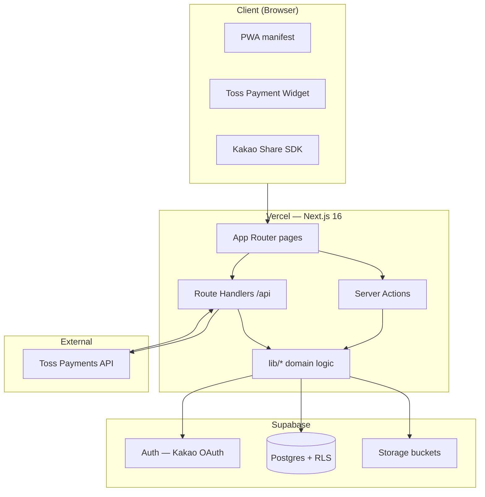
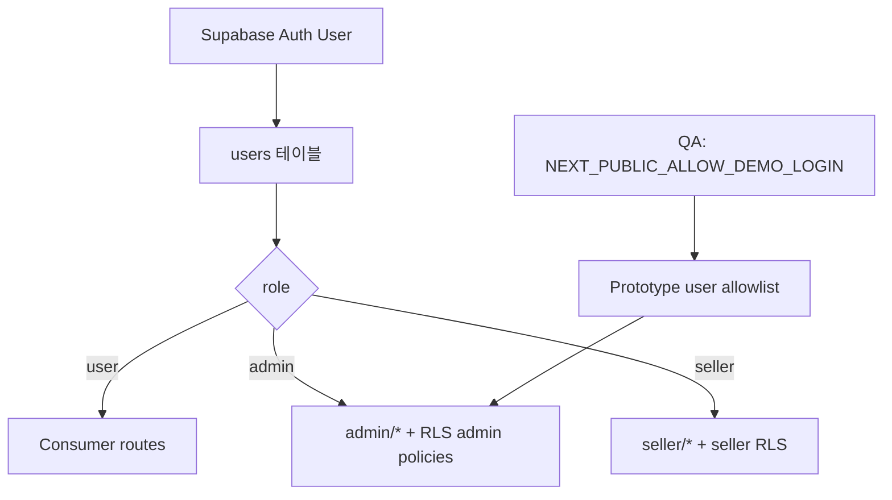

# Wadeal v2 — 아키텍처

> 마지막 업데이트: 2026-05-28  
> 관련: [DATABASE_SCHEMA.md](./DATABASE_SCHEMA.md) · [DEVELOPER_HANDOFF.md](./DEVELOPER_HANDOFF.md) · [ENVIRONMENT_VARIABLES.md](./ENVIRONMENT_VARIABLES.md)

---

## 시스템 구성



| 레이어 | 기술 | 역할 |
| --- | --- | --- |
| UI | React 19, Tailwind CSS 3 | 페이지·컴포넌트 |
| Framework | Next.js 16 App Router | SSR, RSC, Server Actions |
| Backend | Supabase JS (`@supabase/ssr`) | DB, Auth, Storage |
| PG | `@tosspayments/tosspayments-sdk` | 결제 위젯·서버 승인 |
| Deploy | Vercel | 호스팅, env, cron(수동/외부) |

---

## Next.js App Router 구조

```
app/
├── layout.tsx              # Root layout, AuthProvider
├── page.tsx                # Home catalog
├── loading.tsx, error.tsx, not-found.tsx, global-error.tsx
├── product/[id]/           # Product detail
├── category/[slug]/        # Category listing
├── search/                 # Search
├── join/[id]/              # Group-buy join
├── join-cart/, join-complete/
├── checkout/[id]/          # Checkout shell
├── payment/
│   ├── request/[orderId]/  # Toss widget / pay UI
│   ├── success/, fail/
├── mypage/                 # User account area
├── admin/                  # Admin console (role-gated)
├── seller/                 # Seller center (seller role)
├── support/                # Customer tickets
├── api/payments/           # Toss confirm, webhook, billing
├── actions/                # Server Actions (colocated modules)
└── auth/callback/          # Supabase OAuth callback
```

### 라우트 그룹 특성

| 영역 | 인증 | 비고 |
| --- | --- | --- |
| `app/mypage/*` | 로그인 필수 (페이지·액션에서 검증) | |
| `app/admin/*` | `isAdminUser()` | `users.role = admin` 또는 QA allowlist |
| `app/seller/*` | `SellerRouteGate` | `sellers.status = approved` |
| `app/checkout`, `app/payment` | 로그인 필수 | |
| Public catalog | 비로그인 허용 | RLS로 approved 상품만 |

### Server Components vs Client

- **RSC:** 목록·상세 데이터 fetch (`lib/data/*`, `lib/services/deals.ts`)
- **Client:** 결제 위젯, 폼 상호작용, 카카오 공유, bottom navigation
- **Server Actions:** `app/actions/*` — mutation, revalidate

---

## `lib/` 디렉터리 구조

```
lib/
├── data/           # Supabase queries (adapter pattern)
├── auth/           # Session, admin/seller access, OAuth
├── payments/       # Payment lifecycle, Toss, billing
├── orders/         # Order flow, finalize deal, shipping snapshot
├── discounts/      # Coupon, points
├── pricing/        # Tier resolution
├── deals/          # Lifecycle (deadline, closed)
├── notifications/  # In-app notification builders
├── admin/          # Launch readiness, activity log helpers
├── supabase/       # client, server, config, storage helpers
├── env/            # runtime flags (mock, demo login)
├── database/       # types, models
└── share/, search/, shipping/, identity/, settlements/, ...
```

**데이터 접근 패턴:** `lib/data/index.ts` → feature modules (`deals.ts`, `orders.ts`, …). `lib/data/source.ts` 가 mock vs Supabase 선택.

---

## Supabase 구조

### Auth

- **Provider:** Kakao OAuth via `signInWithOAuth` ([`lib/auth/supabase-oauth.ts`](../lib/auth/supabase-oauth.ts))
- **Callback:** `app/auth/callback/route.ts` — code exchange, profile sync
- **세션:** `@supabase/ssr` cookie session ([`lib/auth/server-session.ts`](../lib/auth/server-session.ts))
- **프로필:** `users` 테이블 — `sync-user-profile` on first login

Kakao REST/Secret은 **Supabase Dashboard** 에만 설정 (Vercel env 아님).  
가이드: [kakao-auth-reconnect.md](./kakao-auth-reconnect.md).

### Database

- Migrations: `supabase/migrations/*.sql` (40 files, prefix order)
- Schema doc: [DATABASE_SCHEMA.md](./DATABASE_SCHEMA.md)
- Types: `lib/database/types.ts` (수동·생성 혼합)

### Storage

| Bucket | 용도 | 정책 |
| --- | --- | --- |
| `product-images` | 상품 이미지 | Public read, admin write |
| `review-images` | 리뷰 이미지 | Public read, owner path write |

Helpers: `lib/supabase/product-images-storage.ts`, `review-images-storage.ts`.

---

## Server Actions

`app/actions/` — 도메인별 mutation. 주요 모듈:

| 파일 | 역할 |
| --- | --- |
| `auth.ts` | 로그인·로그아웃 |
| `data.ts` | 주문 생성, admin 주문 업데이트 |
| `payments.ts` | 결제 상태 동기화 |
| `admin-products.ts` | 상품 CRUD, 마감, 승인 |
| `admin-deals.ts` | 딜 finalize |
| `join-cart.ts` | 참여 장바구니 |
| `discounts.ts` | 쿠폰·포인트 |
| `addresses.ts`, `saved-payment-methods.ts` | 배송지·카드 |
| `support.ts` | 문의·관리자 답변 |
| `admin-settlements.ts`, `admin-suppliers.ts` | B2B 운영 |

관리자 mutation은 `createAdminActivityLog()` 로 감사 로그 기록 ([ADMIN_AUDIT_LOGS.md](./ADMIN_AUDIT_LOGS.md)).

---

## API Routes

| Method | Path | 용도 |
| --- | --- | --- |
| GET | `/auth/callback` | OAuth callback |
| POST | `/api/payments/toss/confirm` | 결제 승인 (client → server) |
| POST | `/api/payments/toss/webhook` | Toss webhook → `webhook_logs` |
| POST | `/api/payments/billing/issue` | 빌링키 등록 |
| POST | `/api/payments/billing/charge` | 자동결제 (Bearer `CRON_SECRET`) |
| DELETE | `/api/payments/billing/[id]` | 카드 비활성화 |

Webhook 처리: `lib/payments/toss/webhook/process-webhook.ts`.

---

## 인증·권한



| 검사 | 구현 |
| --- | --- |
| Admin | `lib/auth/admin-access.ts` — `users.role === 'admin'` |
| Seller | `lib/auth/seller-access.ts` — `sellers` row + status |
| RLS | Postgres policies — 클라이언트는 publishable key만 |

**중요:** `SUPABASE_SERVICE_ROLE_KEY` 는 Wadeal 앱에서 **사용하지 않음**. 서버도 사용자 세션 + RLS(및 SECURITY DEFINER RPC)로 동작.

---

## RLS 정책 개요

Migration `009_production_rls.sql`, `019_security_rls_hardening.sql` 가 핵심.

| 패턴 | 예시 |
| --- | --- |
| Public read | `products` — `is_active` + `approval_status = approved` |
| Own row | `orders`, `addresses`, `notifications` SELECT own |
| Admin override | `*_select_admin`, `*_update_admin` |
| No client write | `payments` status — RPC only |
| Immutable audit | `admin_activity_logs` — INSERT only |

상세 테이블별: [DATABASE_SCHEMA.md](./DATABASE_SCHEMA.md#rls-요약).

### SECURITY DEFINER RPC (대표)

- `create_pending_payment_for_order`, `update_payment_status`
- `prepare_payment_after_finalize`
- `register_saved_payment_method`, `mark_notification_read`
- `reserve_stock`, `reserve_groupbuy_quantity`
- `apply_coupon`, `commit_discounts`, `rollback_discounts`

---

## Vercel 배포

1. Git 연동 → Production branch deploy
2. Environment Variables — [ENVIRONMENT_VARIABLES.md](./ENVIRONMENT_VARIABLES.md)
3. `NEXT_PUBLIC_SITE_URL` — OG, sitemap, share links
4. Supabase Redirect URLs — `https://{domain}/auth/callback`
5. `npm run build` — CI/Vercel build command

**Cron:** 자동결제 배치는 `/api/payments/billing/charge` + `CRON_SECRET` (Vercel Cron 또는 외부 스케줄러 설정 필요).

---

## 관측·로깅

| 대상 | 저장소 | UI |
| --- | --- | --- |
| Admin actions | `admin_activity_logs` | `/admin/activity-logs` |
| App errors | `error_logs` | admin actions (조회) |
| PG webhooks | `webhook_logs` | `/admin/payments` |

---

## SEO·PWA

- `app/sitemap.ts`, `app/robots.ts`, `lib/seo/site.ts`
- `app/manifest.ts` — PWA manifest (기본 설정)

---

## 기존 상세 문서 링크

| 문서 | 내용 |
| --- | --- |
| [PAYMENT_FLOW.md](./PAYMENT_FLOW.md) | payment_flow enum·빌링 API |
| [ADMIN_AUDIT_LOGS.md](./ADMIN_AUDIT_LOGS.md) | 감사 로그 |
| [ENVIRONMENT_VARIABLES.md](./ENVIRONMENT_VARIABLES.md) | env 전체 목록 |
