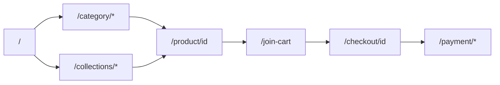

# CELLOH Screen to File Map

**Date:** 2026-05-29  
**Branch:** `mobile-ui`  
**Status:** Reference map — verify paths after large refactors

**Related:** [CELLOH_FILE_INVENTORY.md](./CELLOH_FILE_INVENTORY.md), [CELLOH_SCREENSHOT_QA_CHECKLIST.md](./CELLOH_SCREENSHOT_QA_CHECKLIST.md)

---

## Shared shell (most buyer routes)

```
app/layout.tsx
  └── components/app-buyer-layout.tsx
        └── components/app-buyer-chrome.tsx (header, category bar, bottom nav)
        └── components/app-buyer-shell.tsx
              ├── AddToCartSheetProvider (lib/cart/add-to-cart-sheet-context.tsx)
              ├── CartPreviewSheetProvider (lib/cart/cart-preview-sheet-context.tsx)
              ├── CartAddedBottomSheet
              └── CartPreviewBottomSheet
```

**Styles:** `app/globals.css`, `lib/design-system.ts`, `lib/ui.ts`

---

## Home (`/`)

| Layer | Files |
|-------|-------|
| **Route** | `app/page.tsx` |
| **Data** | `lib/data/index.ts` → `getAllActiveDeals()`, `lib/home/build-home-view.ts` |
| **Layout** | `components/app-buyer-layout.tsx` |
| **Main UI** | `components/home-catalog.tsx` |
| **Sections** | `components/home/home-quick-menu.tsx` |
| | `components/home/home-commerce-rail-section.tsx` |
| | `components/home/home-commerce-rail-track.tsx` |
| | `components/home/home-ranking-section.tsx` |
| | `components/home/home-ranking-column.tsx` |
| | `components/home/home-seller-showcase-section.tsx` |
| | `components/home/home-only-celloh-section.tsx` |
| | `components/home/home-seller-stories-section.tsx` |
| | `components/home/hero-carousel.tsx` |
| **Cards** | `components/home-recommended-deal-card.tsx` |
| | `components/product-card-content.tsx` |
| | `components/product-card-image.tsx` |
| | `components/cart/cart-quantity-control.tsx` |
| **Copy** | `lib/copy/home-section-copy.ts`, `lib/home/quick-menu-items.ts` |
| **CSS** | `app/globals.css` (`.commerce-rail-item`, `--celloh-app-width`) |
| **Client growth** | `components/growth/home-growth-client-sections.tsx` (optional rails) |

**Test after edit:** `/`, `/collections/today-special`

---

## Category PLP (`/category/[slug]`)

| Layer | Files |
|-------|-------|
| **Route** | `app/category/[slug]/page.tsx` |
| **Content** | `components/plp/category-plp-content.tsx` |
| **Sub nav** | `components/category-sub-nav.tsx` |
| **Toolbar** | `components/deal-catalog-toolbar.tsx` |
| **Grid** | `components/deal-product-grid.tsx` → `components/deal-card.tsx` |
| **Filter/sort** | `components/plp/plp-filter-sheet.tsx`, `plp-sort-dropdown.tsx` |
| **Data** | `lib/categories/*`, `lib/data/search.ts`, `lib/search/params.ts` |
| **Chips** | `components/category-chip.tsx` |

**Subcategory URL:** `?sub=fruit` → search params in page + `CategorySubNav`

**Test after edit:** `/category/food`, `/category/food?sub=fruit`, `/category/living`

---

## Product detail (`/product/[id]`)

| Layer | Files |
|-------|-------|
| **Route** | `app/product/[id]/page.tsx` |
| **Gallery / summary** | `components/product-image-gallery.tsx`, `components/product-summary-panel.tsx` |
| **Product folder** | `components/product/product-detail-purchase-bar.tsx` |
| | `components/product/product-detail-shipping-summary.tsx` |
| | `components/product/product-detail-seller-card.tsx` |
| | `components/product/product-detail-info-table.tsx` |
| | `components/product/product-inquiry-section.tsx` |
| **Cart UX** | `components/cart/cart-quantity-control.tsx` |
| | `components/cart/cart-added-bottom-sheet.tsx` |
| | `components/cart/cart-preview-bottom-sheet.tsx` |
| **Related** | `components/similar-products-section.tsx` |
| **Data** | `lib/data/*`, `lib/product/detail-data.ts`, `lib/pricing/tiers.ts` |

**Test after edit:** `/product/1`, `/product/11`

---

## Cart (`/join-cart`)

| Layer | Files |
|-------|-------|
| **Route** | `app/join-cart/page.tsx` |
| **Content** | `components/join-cart-content.tsx` |
| | `components/join-cart/join-cart-coupon-notice.tsx` |
| | `components/join-cart-promo-section.tsx` |
| **Cart components** | `components/cart/sticky-order-bar.tsx` |
| | `components/cart/cart-coupon-progress.tsx` |
| | `components/growth/cart-growth-recommendations.tsx` |
| **Lib** | `lib/cart/cart-store.ts`, `lib/data/join-cart.ts`, `lib/coupon/tier-coupon.ts` |
| **Actions** | `app/actions/join-cart.ts` |

**Test after edit:** `/join-cart` (empty + with items)

---

## Collections (`/collections/[slug]`)

| Layer | Files |
|-------|-------|
| **Route** | `app/collections/[slug]/page.tsx` |
| **Definition** | `lib/home/collection-data.ts` |
| **UI** | `components/collections/collection-page-content.tsx` |
| **Grid** | `components/deal-product-grid.tsx`, `components/deal-card.tsx` |
| **Menu link** | `lib/home/quick-menu-items.ts` |

**Test after edit:** `/collections/today-special`, `/collections/ranking`, `/collections/popular-sellers`

---

## Seller (buyer + center)

### Public profile (`/sellers/[id]`)

| Layer | Files |
|-------|-------|
| **Route** | `app/sellers/[id]/page.tsx` |
| **Content** | `components/seller-profile-page-content.tsx` |
| **Sections** | `components/seller/seller-profile-*.tsx` |
| **Products** | `components/seller/seller-profile-deals-section.tsx` |
| **Data** | `lib/sellers/build-seller-profile-view.ts`, `showcase-seller-profiles.ts` |

**Test:** `/sellers/moon-fruit`

### Seller center (`/seller/*`)

| Layer | Files |
|-------|-------|
| **Routes** | `app/seller/dashboard/page.tsx`, `…/orders`, `…/products`, etc. |
| **Mock panels** | `components/seller/seller-*-mock-panel.tsx` |
| **Gate** | `lib/sellers/show-seller-mock.ts`, `lib/sellers/route-gate.ts` |

**Test:** `/seller/dashboard` (login or gate)

---

## Admin (`/admin/*`)

| Layer | Files |
|-------|-------|
| **Routes** | `app/admin/dashboard/page.tsx`, … |
| **UI** | `components/admin-dashboard-content.tsx`, `components/admin-*-content.tsx` |
| **Nav** | `components/admin-nav.tsx` |
| **Readiness** | `lib/admin/go-live-readiness.ts`, `lib/admin/mvp-readiness.ts` |

**Test:** `/admin/dashboard`

---

## Policy & support

| Layer | Files |
|-------|-------|
| **Policy route** | `app/policies/[slug]/page.tsx` |
| **Legacy redirects** | `app/privacy/page.tsx`, `app/terms/page.tsx`, … |
| **Content** | `lib/policies/content.ts` |
| **Renderer** | `components/policy-page-content.tsx` |
| **Support hub** | `app/support/page.tsx`, `components/support/*` |
| **Docs (planning)** | `docs/CELLOH_LEGAL_REVIEW_ITEMS.md`, etc. |

**Test:** `/policies/privacy`, `/support`

---

## Checkout & payment

| Layer | Files |
|-------|-------|
| **Checkout** | `app/checkout/[id]/page.tsx`, `components/checkout-*` |
| **Payment** | `app/payment/success/page.tsx`, `app/payment/fail/page.tsx` |
| **Celloh Pay mock** | `components/celloh-pay/*`, `lib/celloh-pay/*` |
| **API** | `app/api/payments/toss/*`, `lib/payments/*` |

**Test:** `/checkout/[slug]`, `/payment/fail`

---

## Search

| Layer | Files |
|-------|-------|
| **Route** | `app/search/page.tsx` |
| **Results** | `components/search/search-results-view.tsx` |
| **Shared PLP** | `deal-catalog-toolbar.tsx`, `deal-product-grid.tsx` |

**Test:** `/search?q=감귤`

---

## Mermaid — buyer purchase path



---

## Filename corrections

| User/doc alias | Actual path |
|----------------|-------------|
| `components/home-quick-menu.tsx` | `components/home/home-quick-menu.tsx` |
| `components/home-catalog.tsx` | root `components/` (not `home/`) |
| Quick menu SoT | `lib/home/quick-menu-items.ts` (not only `collection-data.ts`) |
