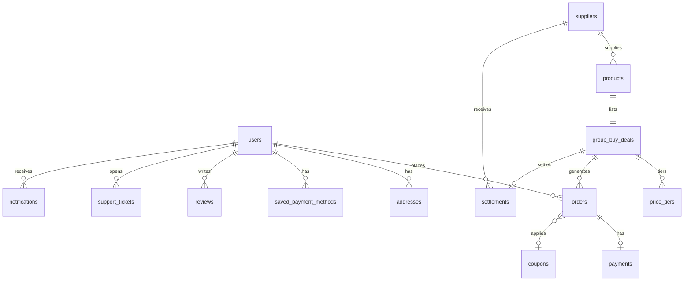

# Wadeal v2 — 데이터베이스 스키마

> 마지막 업데이트: 2026-05-28  
> 소스: `supabase/migrations/*.sql` (40 files)  
> 관련: [ARCHITECTURE.md](./ARCHITECTURE.md) · [SEED_DATA.md](./SEED_DATA.md)

---

## Migration 적용 순서

동일 prefix 번호는 **파일명 사전순** 으로 적용합니다.

| # | 파일 |
| --- | --- |
| 001 | `001_initial_schema.sql` |
| 002–008 | price_alerts, alerts, orders, reviews, reports, admin likes, production RLS |
| 009–015 | RLS, admin products/orders, storage, price_tiers JSONB, order status, payments, shipping |
| 016 | reviews production, search/categories, wishlist/recent/join_cart |
| 017 | notifications, review images storage, share/referral |
| 018 | suppliers/settlements, support_tickets |
| 019 | security RLS hardening, user_consents |
| 020–026 | sellers, product payment methods, catalog columns, webhook_logs, saved_payment_methods, approval, inventory, coupons/points |
| 028–032 | addresses delivery, identity, shipping fees, business_settings, admin_activity_logs, error_logs |

---

## ER 개요

---

## 핵심 테이블

### `users`

| 컬럼 | 타입 | 설명 |
| --- | --- | --- |
| `id` | UUID PK | Supabase Auth UID |
| `kakao_id` | TEXT UNIQUE | 카카오 ID |
| `email`, `nickname` | TEXT | 프로필 |
| `role` | TEXT | `user` \| `seller` \| `admin` |
| `referral_code` | TEXT UNIQUE | 초대 코드 (8자) |
| `phone`, `phone_verified_at` | TEXT, TIMESTAMPTZ | 휴대폰 인증 |
| `real_name`, `birth_date` | TEXT, DATE | 실명 (029) |
| `ci_hash`, `di_hash` | TEXT | CI/DI — **클라이언트 SELECT 불가** |

**RLS:** 본인 SELECT/UPDATE; admin SELECT/UPDATE; role 자가 승격 방지 trigger.

---

### `categories`

| 컬럼 | 타입 | 설명 |
| --- | --- | --- |
| `id` | UUID PK | |
| `slug` | TEXT UNIQUE | URL (`food`, `living`, …) |
| `name`, `description` | TEXT | 표시명 |
| `sort_order`, `display_order` | INT | 정렬 |
| `is_active` | BOOLEAN | 노출 여부 |

**RLS:** public SELECT.

---

### `products`

| 컬럼 | 타입 | 설명 |
| --- | --- | --- |
| `id`, `slug` | UUID, TEXT UNIQUE | 식별자 |
| `name`, `description`, `short_description` | TEXT | |
| `category`, `category_id` | TEXT, UUID FK | 카테고리 |
| `category_tags`, `keywords` | TEXT[] | 필터·검색 |
| `brand_name` | TEXT | |
| `image_url`, `detail_image_urls` | TEXT, TEXT[] | 이미지 |
| `original_price`, `sale_price` | INT | 가격 |
| `product_type` | TEXT | `normal` \| `groupbuy` |
| `status` | TEXT | `draft` \| `active` \| `ended` \| `sold_out` |
| `is_active` | BOOLEAN | 레거시 플래그 |
| `approval_status` | TEXT | `draft` \| `pending_review` \| `approved` \| `rejected` |
| `supplier_id` | UUID FK | 공급사 |
| `stock_quantity`, `sold_quantity` | INT | 재고 |
| `min_order_quantity`, `max_order_quantity`, `per_user_limit` | INT | 구매 제한 |
| `allowed_payment_methods` | TEXT[] | 허용 PG 수단 |
| `shipping_fee`, `free_shipping_threshold`, `shipping_type`, `is_free_shipping`, `remote_area_extra_fee` | INT/TEXT/BOOL | 배송비 |

**RLS:** public — `is_active AND approval_status = approved`; admin/seller creator policies.

**RPC:** `reserve_stock`, `release_stock`.

---

### `group_buy_deals`

| 컬럼 | 타입 | 설명 |
| --- | --- | --- |
| `id` | UUID PK | |
| `product_id` | UUID FK UNIQUE | 1 product : 1 deal |
| `title`, `badge`, `section` | TEXT | UI |
| `current_participants`, `target_participants` | INT | 참여 인원 |
| `current_quantity`, `target_quantity`, `max_quantity` | INT | 수량 기반 (025) |
| `group_price`, `lowest_price` | INT | 표시 가격 |
| `price_tiers` | JSONB | `[{minQty, price}]` |
| `starts_at`, `ends_at` | TIMESTAMPTZ | 기간 |
| `status` | TEXT | `draft` \| `active` \| `closed` \| `cancelled` |

**RPC:** `reserve_groupbuy_quantity`, `release_groupbuy_quantity`, `sync_price_tiers_from_jsonb`.

---

### `price_tiers`

| 컬럼 | 타입 | 설명 |
| --- | --- | --- |
| `deal_id` | UUID FK | |
| `required_participants` | INT | minQty |
| `price` | INT | 단가 |
| `tier_order` | INT | 정렬 |

JSONB(`group_buy_deals.price_tiers`)와 동기화 유지.

---

### `orders`

| 컬럼 | 타입 | 설명 |
| --- | --- | --- |
| `id` | UUID PK | |
| `user_id` | UUID | 구매자 |
| `order_number` | TEXT UNIQUE | `WD-…` |
| `deal_id` | UUID FK | |
| `product_id`, `product_name`, `product_type` | TEXT | 스냅샷 |
| `quantity` | INT | 1–99 |
| `joined_price`, `final_price` | INT | 단가 / 확정 단가 |
| `order_status` | TEXT | `joined` \| `confirmed` \| `cancelled` \| `refunded` |
| `payment_status` | TEXT | `ready` \| `pending` \| `waiting_deposit` \| `paid` \| `failed` \| … |
| `shipping_status` | TEXT | `none` \| `preparing` \| `shipped` \| `delivered` \| `confirmed` \| … |
| `payment_method`, `payment_flow` | TEXT | 수단·흐름 |
| `saved_payment_method_id` | UUID FK | 자동결제 카드 |
| `subtotal_amount`, `final_payment_amount`, `shipping_fee`, `remote_area_extra_fee` | INT | 금액 |
| `coupon_id`, `coupon_discount_amount`, `point_discount_amount` | | 할인 |
| `discount_status` | TEXT | `none` \| `reserved` \| `committed` \| `rolled_back` |
| `address_id` + `shipping_*` snapshot | | 배송지 스냅샷 (028) |
| `courier_company`, `tracking_number` | TEXT | 송장 |
| `orderer_name`, `orderer_phone`, `orderer_verification_status` | TEXT | 주문자 |
| `refund_reason`, `refund_requested_at` | | 환불 |
| `admin_memo` | TEXT | |
| `paid_at`, `shipped_at`, `delivered_at`, `confirmed_at` | TIMESTAMPTZ | |

**RLS:** own SELECT/INSERT; lifecycle UPDATE (trigger guard); admin SELECT/UPDATE.

---

### `payments`

| 컬럼 | 타입 | 설명 |
| --- | --- | --- |
| `id` | UUID PK | |
| `order_id` | UUID FK UNIQUE | 1:1 |
| `user_id`, `deal_id`, `product_id` | | |
| `payment_provider`, `payment_key`, `method` | TEXT | PG |
| `amount`, `requested_amount`, `confirmed_amount` | INT | |
| `status` | TEXT | `ready` \| `waiting_deposit` \| `paid` \| `failed` \| … |
| `payment_flow` | TEXT | |
| `auto_charge_attempted_at` | TIMESTAMPTZ | 자동결제 멱등 |
| `raw_response` | JSONB | PG payload |

**RLS:** own SELECT; admin SELECT/UPDATE; INSERT/UPDATE status → RPC only.

---

### `reviews` / `review_reports` / `review_likes`

**reviews**

| 컬럼 | 설명 |
| --- | --- |
| `order_id` | UNIQUE — 주문당 1리뷰 |
| `rating` | 1–5 |
| `content`, `images` | |
| `is_verified_purchase` | |
| `status` | `visible` \| `hidden` \| `reported` \| `deleted` |

**review_reports:** 신고 사유·상태  
**review_likes:** helpful 투표

---

### `addresses`

| 컬럼 | 설명 |
| --- | --- |
| `recipient_name`, `phone` | |
| `address_line1`, `address_line2`, `postal_code`, `region` | |
| `is_remote_area` | 도서산간 |
| `delivery_memo` | |
| `is_default` | 기본 배송지 (trigger: 1개) |

---

### `notifications`

| 컬럼 | 설명 |
| --- | --- |
| `type` | 이벤트 타입 (아래 enum) |
| `title`, `message`, `link_url` | |
| `channel` | `in_app` \| `kakao` \| `email` \| `push` |
| `read_at` | |

**type (주요):** `payment_ready`, `payment_paid`, `payment_failed`, `shipping_started`, `shipping_delivered`, `deal_deadline_soon`, `price_tier_reached`, `support_reply`, `product_approved`, …

읽음 처리: `mark_notification_read()` RPC only.

---

### `support_tickets`

| 컬럼 | 설명 |
| --- | --- |
| `type` | `shipping` \| `cancel` \| `refund` \| `product` \| `other` |
| `title`, `content` | |
| `status` | `open` \| `answered` \| `resolved` \| `closed` |
| `admin_reply` | |
| `order_id`, `product_id`, `deal_id` | 연관 |

---

### `suppliers` / `settlements`

**suppliers:** `name`, `business_number`, `commission_rate`, `bank_*`, `status` (`active` \| `paused` \| `terminated`)

**settlements:** deal당 1건 — `total_sales_amount`, `commission_amount`, `settlement_amount`, `status` (`pending` \| `confirmed` \| `paid` \| `cancelled`)

---

### `coupons` / `coupon_usages` / `user_points` / `point_transactions`

- **coupons:** `code`, `discount_type` (`fixed_amount` \| `percentage` \| `free_shipping`), 유효기간·한도
- **coupon_usages:** 주문별 사용 기록
- **user_points:** 사용자별 잔액
- **point_transactions:** `earn` \| `use` \| `refund` \| `expire` \| `adjust` 원장

---

### `saved_payment_methods`

| 컬럼 | 설명 |
| --- | --- |
| `billing_key` | **서버 전용** — view `saved_payment_methods_client` 에서 제외 |
| `card_company`, `card_last4` | UI 표시 |
| `status` | `active` \| `inactive` \| `expired` \| `revoked` |

---

### `sellers`

| 컬럼 | 설명 |
| --- | --- |
| `user_id` | UNIQUE FK |
| `company_name`, `business_number` | |
| `status` | `pending_review` \| `approved` \| `rejected` \| `suspended` |
| `bank_*` | 정산 계좌 |

---

### `user_consents`

약관·개인정보·공동구매·마�eting 동의 타임스탬프 (user당 1 row).

---

### `join_cart` / `saved_deals` / `recent_views`

| 테이블 | 용도 |
| --- | --- |
| `join_cart` | 참여 전 장바구니 (user + product UNIQUE) |
| `saved_deals` | 찜(위시리스트) |
| `recent_views` | 최근 본 상품 |

---

### Share / Referral

| 테이블 | 용도 |
| --- | --- |
| `share_logs` | 공유 이벤트 (kakao, copy_link, web_share) |
| `referral_visits` | 초대 링크 방문 (`ip_hash`) |

---

### `business_settings`

Singleton (`id = 1`) — 사업자명, 통신판매업 신고번호, CS, 개인정보 책임자, hosting_provider.

Public SELECT; admin UPDATE.

---

### `admin_activity_logs`

| 컬럼 | 설명 |
| --- | --- |
| `admin_user_id` | |
| `action`, `target_type`, `target_id` | |
| `before_data`, `after_data` | JSONB diff |
| `ip_hash`, `user_agent` | |

Immutable (UPDATE/DELETE trigger deny). 상세: [ADMIN_AUDIT_LOGS.md](./ADMIN_AUDIT_LOGS.md).

---

### `error_logs`

| 컬럼 | 설명 |
| --- | --- |
| `level` | `info` \| `warning` \| `error` \| `critical` |
| `source`, `message`, `stack` | |
| `user_id`, `order_id`, `payment_id`, … | 컨텍스트 |
| `metadata` | JSONB |
| `resolved_at` | |

Admin SELECT/UPDATE; authenticated INSERT 없음 (service role 또는 server-side).

---

### `webhook_logs`

| 컬럼 | 설명 |
| --- | --- |
| `provider` | default `toss` |
| `event_type`, `event_id`, `payment_key`, `order_id` | |
| `raw_payload` | JSONB |
| `status` | `pending` \| `processed` \| `skipped` \| `failed` |

Dedup unique index on `(provider, event_id)`.

---

## Storage

| Bucket | Path convention |
| --- | --- |
| `product-images` | admin upload |
| `review-images` | `{user_id}/…` |

---

## RLS 요약

| 테이블 | Public | User own | Admin |
| --- | --- | --- | --- |
| products/deals/tiers | approved active | creator (seller) | full |
| orders | — | SELECT/INSERT/lifecycle UPDATE | full |
| payments | — | SELECT | SELECT/UPDATE |
| reviews | visible | own CRUD (rules) | moderate |
| suppliers/settlements | — | — | full |
| coupons | — | usage SELECT | full |
| webhook_logs/error_logs | — | — | SELECT |

---

## 레거시·Mock 테이블

| 테이블 | 비고 |
| --- | --- |
| `orders_mock` | 초기 프로토타입 |
| `payment_methods_mock` | mock 카드 (023 이전) |
| `group_buy_participants` | 참여 추적 (orders 중심으로 이전) |
| `price_alerts`, `alerts` | 가격 알림 (알림톡 미연동) |

---

## 알려진 갭

1. **`user_notifications`** — `019` RPC에서 참조하나 CREATE migration 없음
2. **`reviews.deal_id`** FK → `products(id)` (group_buy_deals 아님)
3. **Triple status** — `is_active`, `status`, `approval_status` 공존
4. **Dual tiers** — JSONB + relational `price_tiers` 동기화 필요

---

## 시드

[`supabase/seed.sql`](../supabase/seed.sql) — 가이드: [SEED_DATA.md](./SEED_DATA.md).
