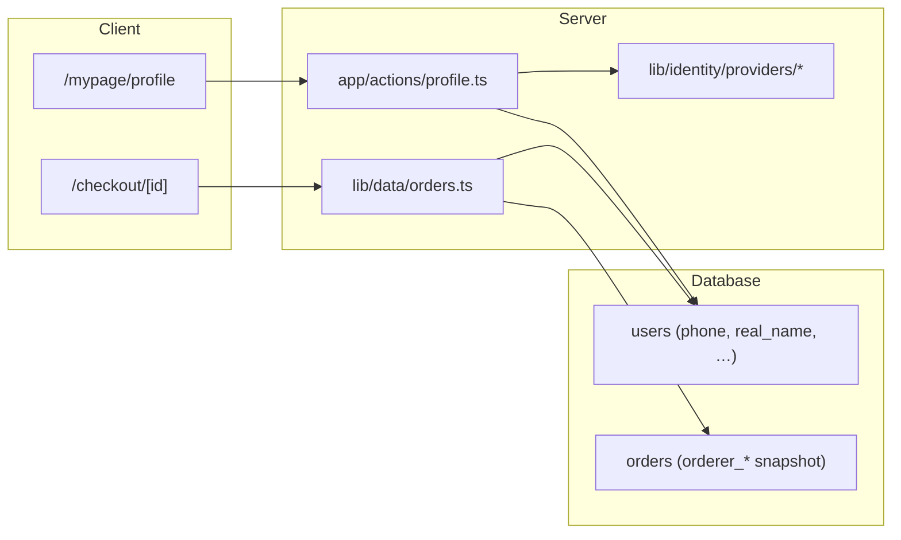

# Identity verification (Wadeal v2)

> Last updated: 2026-05-28  
> Migration: `supabase/migrations/029_identity_verification.sql`

## Overview

Wadeal stores orderer identity on the `users` table and snapshots it on `orders` at checkout time. This supports payment reconciliation, shipping, refunds, and customer support without exposing sensitive CI/DI hashes to clients.



## Data model

### `users` columns

| Column | Type | Notes |
|--------|------|-------|
| `phone` | `TEXT` | Digits only (`010xxxxxxxx`) |
| `phone_verified_at` | `TIMESTAMPTZ` | Set by verification provider |
| `real_name` | `TEXT` | Orderer legal name |
| `birth_date` | `DATE` | Optional; used by full identity providers |
| `ci_hash` | `TEXT` | **Server/admin only** — never SELECT from client |
| `di_hash` | `TEXT` | **Server/admin only** — never SELECT from client |

### `orders` snapshot columns

| Column | Type |
|--------|------|
| `orderer_name` | `TEXT` |
| `orderer_phone` | `TEXT` |
| `orderer_verification_status` | `TEXT` — `unverified` \| `phone_verified` \| `identity_verified` |

Snapshots preserve historical orderer data even if the user profile changes later.

## Verification status

Derived in `lib/identity/verification-status.ts`:

| Status | Condition | Korean label |
|--------|-----------|--------------|
| `unverified` | No `phone_verified_at`, no `ci_hash` | 미인증 |
| `phone_verified` | `phone_verified_at` set, no `ci_hash` | 휴대폰 인증 완료 |
| `identity_verified` | `ci_hash` present | 본인인증 완료 |

## Phone validation

`lib/identity/phone.ts`:

- Korean mobile: must start with `010` and be 11 digits after normalization
- Storage: digits only via `normalizePhone()`
- Display: `formatKoreanMobile()` → `010-1234-5678`

## Pre-order validation

Required before order submit (`lib/identity/orderer-validation.ts`):

1. **Name** — `users.real_name`
2. **Phone** — valid Korean mobile on profile
3. **Shipping address** — default/selected address on checkout

Checkout blocks submit when orderer info is missing. Phone verification is **non-blocking** until a real provider is integrated (guidance banner only).

## Identity provider abstraction

```
lib/identity/
  types.ts
  phone.ts
  verification-status.ts
  orderer-validation.ts
  providers/
    types.ts      # IdentityProvider interface
    mock.ts       # verifyPhoneMock (dev only)
    index.ts      # getIdentityProvider()
```

### `IdentityProvider` interface

- `verifyPhone(userId, phone)` — SMS/ARS phone confirmation
- `verifyIdentity(userId, payload)` — NICE/PASS/Toss full identity (returns CI/DI hashes server-side)

### Environment

```bash
# mock | nice | pass | toss
IDENTITY_PROVIDER=mock
```

- **Development**: `mock` allowed; profile page shows “인증하기 (개발용)”
- **Production**: `mock` is ignored; `getIdentityProvider()` expects `nice`/`pass`/`toss` (not implemented yet)
- `verifyPhoneMock()` and mock UI are **hard-blocked** when `NODE_ENV=production`

## Security

1. **Column REVOKE** — `authenticated` role cannot `SELECT ci_hash`, `di_hash`
2. **Trigger** — users cannot self-update `phone_verified_at`, `ci_hash`, `di_hash`
3. **RPC** — `mark_phone_verified_for_user()` (dev/mock path only; replace with provider webhook in prod)
4. **Admin RLS** — `users_select_admin` policy for support lookups
5. **Client reads** — always use `USER_IDENTITY_SELECT` (excludes hashes)

## Server actions

| Action | File | Purpose |
|--------|------|---------|
| `updateProfileAction` | `app/actions/profile.ts` | Save name + phone with validation |
| `verifyPhoneAction` | `app/actions/profile.ts` | Dev mock verification only |
| Order submit | `app/actions/data.ts` | `validateOrdererInfoForUser()` before `createOrder()` |

## Future integration guide

### NICE / PASS / Toss (recommended steps)

1. Implement provider class in `lib/identity/providers/nice.ts` (or `pass.ts`, `toss.ts`)
2. Register in `lib/identity/providers/index.ts` `getIdentityProvider()` switch
3. Add server route for provider callback/webhook (store `ci_hash`, `di_hash`, `birth_date` via service role or SECURITY DEFINER function)
4. Replace `mark_phone_verified_for_user()` with provider-specific verification RPC
5. Set `IDENTITY_PROVIDER=nice` (or `pass` / `toss`) in production env
6. Remove or gate mock RPC behind explicit dev flag

### Production mock prohibition

- Never set `IDENTITY_PROVIDER=mock` in production
- Never expose dev “인증하기” button in production builds
- `isMockIdentityProviderEnabled()` returns `false` when `NODE_ENV=production`

## UI surfaces

| Surface | Path / component | Shows |
|---------|------------------|-------|
| Mypage profile | `/mypage/profile` | Name, phone, badge, edit, dev verify |
| Checkout | `CheckoutOrdererSection` | Orderer name/phone, status, guidance |
| Admin order detail | `AdminOrdersContent` | Snapshot name, phone, verification label |

## Related files

- Migration: `supabase/migrations/029_identity_verification.sql`
- User data: `lib/data/users.ts`
- Order snapshot: `lib/data/orders.ts` (`createOrder`)
- Admin: `lib/data/admin-orders.ts`
