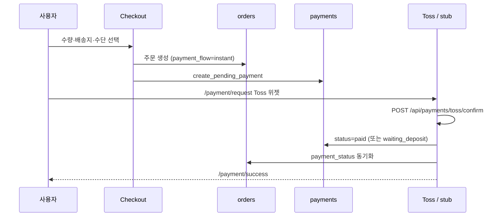
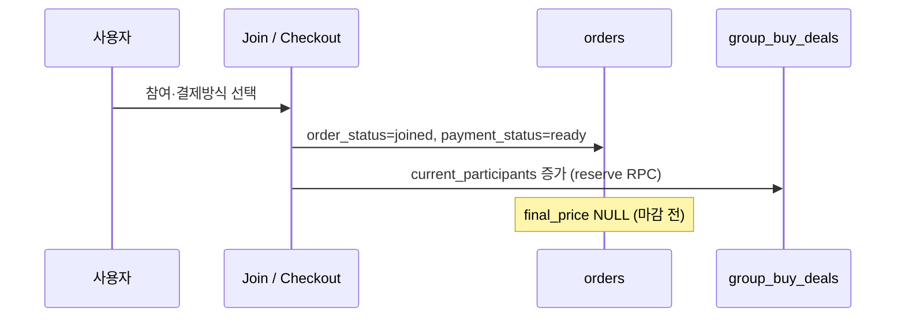
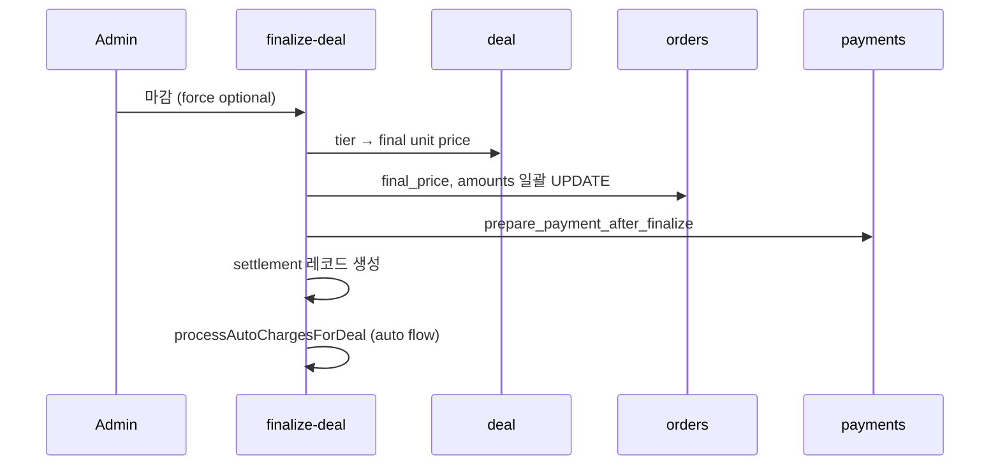
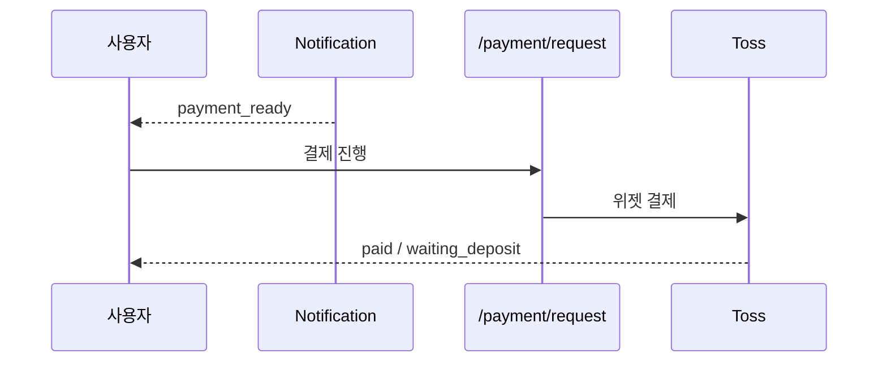
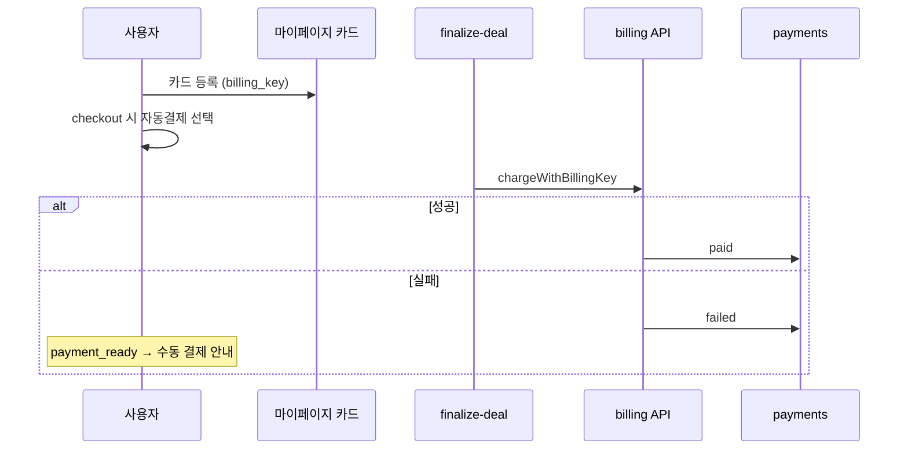

# Wadeal v2 — 주문·결제 흐름

> 마지막 업데이트: 2026-05-28  
> 관련: [PAYMENT_FLOW.md](./PAYMENT_FLOW.md) · [PROJECT_OVERVIEW.md](./PROJECT_OVERVIEW.md) · [DATABASE_SCHEMA.md](./DATABASE_SCHEMA.md)

---

## 상태 모델 요약

### 주문 (`order_status`)

| 값 | 의미 |
| --- | --- |
| `joined` | 공동구매 참여 완료 (결제 전) |
| `confirmed` | 결제·구매 확정 |
| `cancelled` | 취소 |
| `refunded` | 환불 완료 |

일반 상품은 초기 `pending` (legacy `status` 컬럼 병행).

### 결제 (`payment_status`)

| 값 | 의미 |
| --- | --- |
| `ready` | 결제 대기 (공동구매 참여 직후) |
| `pending` | PG 진행 중 |
| `waiting_deposit` | 가상계좌 입금 대기 |
| `paid` | 결제 완료 |
| `failed` | 결제 실패 |
| `cancelled` | 결제 취소 |
| `refunded` | 환불 |

### 배송 (`shipping_status`)

`none` → `preparing` → `shipped` → `delivered` → (사용자) `confirmed`

---

## 1. 일반 상품 — 즉시 결제 (`instant`)

**코드 경로**

- 주문 flow: `lib/orders/order-flow.ts` → `getNormalCheckoutState`
- Stub (키 없음): `lib/payments/process-instant-payment.ts`
- Toss: `components/toss-payment-widget.tsx` → `app/api/payments/toss/confirm/route.ts` → `lib/payments/toss/apply-confirm-result.ts`

**가상계좌:** `virtual_account` 선택 시 `waiting_deposit` — webhook `DEPOSIT_CALLBACK` 처리 (`lib/payments/toss/webhook/handlers/deposit-completed.ts`).

---

## 2. 공동구매 — 참여 (Join)

**경로:** `/join/[id]`, `/join-cart`, `/checkout/[id]`

- 초기 상태: `lib/orders/order-flow.ts` → `getGroupBuyJoinState`
- `payment_flow`: 기본 `post_deadline_manual`, 선택 `post_deadline_auto`
- `saved_payment_method_id`: 자동결제 예약 시 FK

---

## 3. 마감·최종 단가 확정 (`final_price`)

**트리거:** Admin 「공동구매 마감」 (`app/actions/admin-deals.ts`) 또는 기한 경과 후 수동 finalize.

**핵심:** `lib/orders/finalize-deal.ts`

1. `getCurrentTierPrice()` — 현재 참여 수 기준 tier
2. 주문별 `calculateOrderAmounts()` — 배송비·할인 반영
3. `preparePaymentAfterFinalize()` — payment `ready`, 알림 `payment_ready`
4. `processAutoChargesForDeal()` — `post_deadline_auto` 주문만

**조건:** tier 없음·주문 없음·이미 closed → 에러 반환.

---

## 4. 마감 후 직접 결제 (`post_deadline_manual`)

알림 deep link → `/payment/request/[orderId]`.

---

## 5. 카드 자동결제 (`post_deadline_auto`)

**보안**

- `billing_key` — DB only, view `saved_payment_methods_client` 제외
- 멱등: `payments.auto_charge_attempted_at`
- API: `POST /api/payments/billing/charge` (Bearer `CRON_SECRET`)

**현재:** `lib/payments/toss/billing.ts` — `TOSS_SECRET_KEY` 없거나 `TOSS_BILLING_MOCK=true` 이면 **mock**.

---

## 6. Toss 결제 위젯

**컴포넌트:** `components/toss-payment-widget.tsx`

| prop | 설명 |
| --- | --- |
| `clientKey` | `NEXT_PUBLIC_TOSS_PAYMENTS_CLIENT_KEY` |
| `customerKey` | 사용자 UUID (또는 ANONYMOUS) |
| `orderId` | Wadeal order UUID |
| `amount` | `final_payment_amount` |
| `paymentMethod` | variantKey 매핑 |

**페이지:** `app/payment/request/[orderId]/page.tsx`

**승인:** 클라이언트 successUrl → 서버 `POST /api/payments/toss/confirm` → Toss REST confirm.

**환경:** `lib/payments/toss/env.ts` — 키 존재 여부 검사.

---

## 7. Webhook

**Endpoint:** `POST /api/payments/toss/webhook`

| Handler | 이벤트 |
| --- | --- |
| `payment-approved` | 결제 승인 |
| `deposit-completed` | 가상계좌 입금 |
| `payment-cancelled` | 취소 |
| `payment-failed` | 실패 |
| `refund-completed` | 환불 |

로그: `webhook_logs` (`lib/payments/toss/webhook/webhook-logs.ts`).

**TODO:** 일부 이벤트 signature 검증·secret 매칭 미완 (`verify-signature.ts`).

---

## 8. 할인 (쿠폰·포인트)

체크아웃: `app/actions/discounts.ts` → RPC `apply_coupon`, `reserve_points`

| 단계 | `discount_status` |
| --- | --- |
| 적용 | `reserved` |
| 결제 성공 | `committed` |
| 실패/취소 | `rolled_back` |

계산: `lib/discounts/calculate-order-total.ts`, `lib/orders/calculate-order-amounts.ts`.

---

## 9. 환불·취소

### 사용자

- 배송 전/후: 주문 상세 → 환불 요청 → `refund_requested_at`, `refund_reason`
- 문의: `/support/new` (type `refund`)

### 관리자

- `/admin/orders` — `payment_status=refunded`, `order_status=refunded`
- PG 연동 전: **수동 환불 후 DB 상태만 반영**
- Webhook `refund-completed` — PG 연동 후 자동 동기화

### 참여 취소 (마감 전)

- `order_status=cancelled`, inventory/groupbuy quantity `release_*` RPC

---

## 10. 배송 전환

| 단계 | 담당 | DB |
| --- | --- | --- |
| 결제 완료 | PG/webhook | `paid_at`, `payment_status=paid` |
| 배송 준비 | Admin | `shipping_status=preparing` |
| 출고 | Admin | `courier_company`, `tracking_number`, `shipped_at`, `shipped` |
| 배달 완료 | Admin | `delivered`, `delivered_at` |
| 구매 확정 | User/Admin | `confirmed`, `confirmed_at` |

알림: `shipping_started`, `shipping_delivered` (`lib/notifications/order-events.ts`).

배송지 스냅샷: 주문 생성 시 `lib/orders/shipping-snapshot.ts`.

---

## payment_flow · payment_method 매트릭스

| product_type | payment_flow | 결제 시점 |
| --- | --- | --- |
| normal | instant | checkout 직후 |
| groupbuy | post_deadline_manual | 마감 후 사용자 |
| groupbuy | post_deadline_auto | 마감 후 서버 billing |

---

## PG 연동 체크리스트

- [ ] `NEXT_PUBLIC_TOSS_PAYMENTS_CLIENT_KEY` (live)
- [ ] `TOSS_PAYMENTS_SECRET_KEY` (server confirm/cancel)
- [ ] `TOSS_PAYMENTS_WEBHOOK_SECRET` (webhook 검증)
- [ ] Webhook URL Vercel production 등록
- [ ] 가상계좌 입금 webhook 테스트
- [ ] 빌링: `TOSS_SECRET_KEY` + mock 해제

출시: [GO_LIVE_CHECKLIST.md](./GO_LIVE_CHECKLIST.md) · [PG_REVIEW_PREP.md](./PG_REVIEW_PREP.md).

---

## 관련 코드 인덱스

| 영역 | 파일 |
| --- | --- |
| Order status labels | `lib/orders/order-status.ts` |
| Payment sync | `lib/payments/sync-order-payment-status.ts` |
| Can pay gate | `lib/payments/can-pay-order.ts` |
| Auto charge | `lib/payments/auto-charge.ts` |
| Admin payment UI | `components/admin-payments-content.tsx` |
