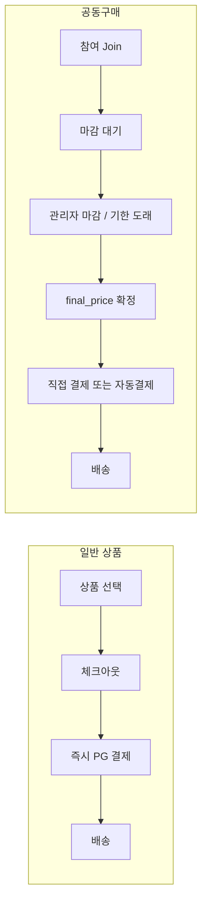
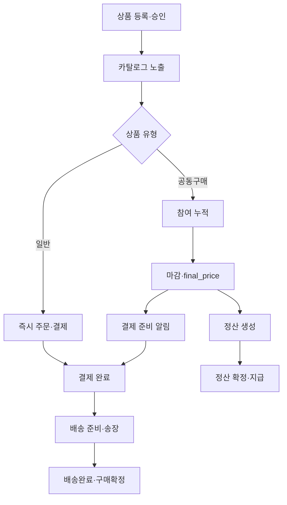

# Wadeal v2 — 프로젝트 개요

> 마지막 업데이트: 2026-05-28  
> 관련 문서: [ARCHITECTURE.md](./ARCHITECTURE.md) · [DATABASE_SCHEMA.md](./DATABASE_SCHEMA.md) · [ORDER_PAYMENT_FLOW.md](./ORDER_PAYMENT_FLOW.md) · [ADMIN_GUIDE.md](./ADMIN_GUIDE.md)

---

## 서비스 소개

**Wadeal(와딜)** 은 수량 기반 단계 할인이 적용되는 **공동구매** 와 **일반 즉시구매** 를 함께 제공하는 커머스 플랫폼입니다. Next.js App Router 프론트엔드, Supabase(Postgres + Auth + Storage), Toss Payments 연동을 기반으로 합니다.

| 영역 | 설명 |
| --- | --- |
| 소비자 | 홈·카테고리·검색, 상품 상세, 공동구매 참여, 체크아웃, 마이페이지, 알림, 고객센터 |
| 관리자 | 상품·주문·결제·리뷰·정산·공급사·사업자 설정·출시 준비 대시보드 |
| 판매자(셀러) | 신청·대시보드·상품·주문·정산 (베타 UI, `users.role = seller`) |

**데이터 소스:** 프로덕션은 Supabase 필수. 개발 환경에서만 Supabase 미설정 시 `lib/deals.ts` mock 카탈로그 폴백 가능 ([`lib/env/runtime.ts`](../lib/env/runtime.ts)).

---

## 상품 구조

### 일반 상품 (`product_type = normal`)

- 카탈로그: `products` + `group_buy_deals` (목록·마감 UI용 deal row 1:1)
- 가격: `sale_price` (또는 deal `group_price`) 기준 **즉시 결제**
- 재고: `stock_quantity`, `sold_quantity`, `reserve_stock` / `release_stock` RPC
- 체크아웃: 주문 생성 → `/payment/request/[orderId]` → Toss 위젯 또는 stub 결제

### 공동구매 상품 (`product_type = groupbuy`)

- 참여 인원(또는 수량)에 따라 **단계별 단가** 적용
- 마감 전: 참여만 하고 결제는 보류 (`payment_status = ready`)
- 마감 후: 현재 참여 수 기준 **최종 단가(`final_price`)** 확정 → 결제 진행
- 결제 방식 선택: 마감 후 직접 결제(기본) / 카드 자동결제 예약(선택)

---

## 수량·참여 단계 가격 (Quantity tier pricing)

- **저장:** `group_buy_deals.price_tiers` JSONB — `[{ "minQty": 10, "price": 24900 }, ...]`
- **관계형 미러:** `price_tiers` 테이블 (`sync_price_tiers_from_jsonb` RPC)
- **표시:** 상품 상세 `PriceTierSteps`, `TierPricing` 컴포넌트
- **적용 시점:** 공동구매 **마감 시** `getCurrentTierPrice()` 로 최종 단가 계산 → 주문 `final_price` 일괄 갱신

| 필드 | 의미 |
| --- | --- |
| `minQty` / `required_participants` | 해당 단가가 적용되는 최소 참여(수량) |
| `price` | 해당 구간 단가 (원) |
| `current_participants` | 현재 참여 인원 (마감 전 실시간) |
| `lowest_price` | 최저 tier 가격 (UI·알림용) |

---

## 결제 수단·결제 흐름

### 결제 수단 (`payment_method`)

| 값 | 설명 |
| --- | --- |
| `card` | 카드 |
| `kakaopay` | 카카오페이 |
| `tosspay` | 토스페이 |
| `naverpay` | 네이버페이 |
| `phone` | 휴대폰 결제 |
| `virtual_account` | 가상계좌 (입금 대기 `waiting_deposit`) |

상품별 허용 수단: `products.allowed_payment_methods` (migration `021`).

### 결제 흐름 (`payment_flow`)

| 값 | 대상 | 설명 |
| --- | --- | --- |
| `instant` | 일반 상품 | 체크아웃 직후 PG |
| `post_deadline_manual` | 공동구매 (기본) | 마감·가격 확정 후 사용자가 `/payment/request` 에서 결제 |
| `post_deadline_auto` | 공동구매 (선택) | 마감 후 등록 카드 빌링키 자동 결제 시도 |

자세한 시퀀스: [ORDER_PAYMENT_FLOW.md](./ORDER_PAYMENT_FLOW.md), [PAYMENT_FLOW.md](./PAYMENT_FLOW.md).

### PG 연동 상태 (2026-05 기준)

| 기능 | 상태 |
| --- | --- |
| Toss 결제 위젯 UI | 구현 (`components/toss-payment-widget.tsx`) |
| `/api/payments/toss/confirm` | 구현 (Secret Key 필요) |
| `/api/payments/toss/webhook` | 구현 + `webhook_logs` |
| 일반 checkout stub | `processInstantPayment` — PG 키 없으면 stub |
| 빌링키 자동결제 | mock/stub (`lib/payments/toss/billing.ts`, `TOSS_BILLING_MOCK`) |

---

## 관리자 기능 요약

| 메뉴 | 경로 | 기능 |
| --- | --- | --- |
| 대시보드 | `/admin/dashboard` | 출시 준비·env·미처리 건수 |
| 상품 | `/admin/products` | 등록·수정·tier·마감·승인 |
| 주문 | `/admin/orders` | 상태·배송·환불 |
| 결제 | `/admin/payments` | 결제·웹훅 로그 조회 |
| 공급사 | `/admin/suppliers` | 공급사 CRUD |
| 정산 | `/admin/settlements` | 마감 후 정산 확정 |
| 리뷰 | `/admin/reviews` | 숨김·삭제 |
| 리뷰 신고 | `/admin/review-reports` | 신고 처리 |
| 문의 | `/admin/support` | 티켓 답변 |
| 셀러 | `/admin/sellers` | 판매자 승인 |
| 사업자 설정 | `/admin/settings/business` | 푸터·법적 정보 |
| 활동 로그 | `/admin/activity-logs` | 관리자 감사 로그 |

운영 상세: [ADMIN_GUIDE.md](./ADMIN_GUIDE.md) · [ADMIN_OPERATIONS.md](./ADMIN_OPERATIONS.md).

---

## 운영 플로우 (Operational flow)

### 일일 운영 (권장)

1. `/admin/dashboard` — 미처리 문의·환불·마감 예정 딜
2. `/admin/orders` — 신규 주문 송장 입력
3. `/admin/review-reports` — 신고 처리
4. `/admin/settlements?status=pending` — 정산 검토

출시 전: [GO_LIVE_CHECKLIST.md](./GO_LIVE_CHECKLIST.md) · [LAUNCH_QA_CHECKLIST.md](./LAUNCH_QA_CHECKLIST.md).

---

## 사용자 여정 (요약)

| 단계 | 경로·동작 |
| --- | --- |
| 탐색 | `/`, `/category/[slug]`, `/search` |
| 상세 | `/product/[id]` — tier, 참여 CTA, 공유 |
| 참여 | `/join/[id]`, `/join-cart`, `/join-complete` |
| 체크아웃 | `/checkout/[id]` — 배송지·동의·할인·결제 방식 |
| 결제 | `/payment/request/[orderId]`, `/payment/success`, `/payment/fail` |
| 마이페이지 | `/mypage/*` — 주문·참여중·알림·리뷰·주소·카드 |
| 고객센터 | `/support`, `/support/new` |

---

## 정책·법무 문서 (초안)

- [TERMS_DRAFT.md](./TERMS_DRAFT.md)
- [PRIVACY_DRAFT.md](./PRIVACY_DRAFT.md)
- [REFUND_POLICY_DRAFT.md](./REFUND_POLICY_DRAFT.md)
- [GROUPBUY_POLICY_DRAFT.md](./GROUPBUY_POLICY_DRAFT.md)

---

## 미완성·주의 사항

| 항목 | 상태 |
| --- | --- |
| 카카오 알림톡 | env·TODO만 존재, 발송 미구현 |
| 실 Toss Billing API | mock (`TOSS_BILLING_MOCK`) |
| `user_notifications` RPC 참조 | migration 미생성 (dead reference 가능) |
| Service Role Key | 앱 코드에서 미사용 (RLS + publishable key) |

로드맵: [ROADMAP.md](./ROADMAP.md).
