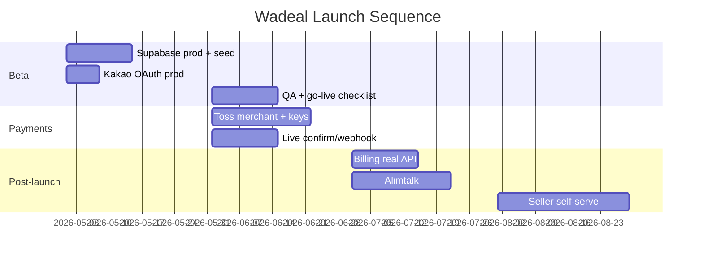

# Wadeal v2 — 로드맵

> 마지막 업데이트: 2026-05-28  
> **코드베이스 기준** — 구현됨 / 진행 중 / 미착수를 구분합니다.

---

## Phase 0 — MVP (현재 상태: 대부분 완료)

| 기능 | 상태 | 비고 |
| --- | --- | --- |
| 카탈로그 (홈·카테고리·검색) | ✅ | Supabase + seed |
| 상품 상세·tier UI | ✅ | |
| 공동구매 참여·join cart | ✅ | |
| Checkout (배송지·동의·할인) | ✅ | |
| Admin 상품·주문·리뷰 | ✅ | |
| 마감·final_price | ✅ | `finalize-deal.ts` |
| 정산·공급사 | ✅ | |
| 고객센터 티켓 | ✅ | user + admin UI |
| Kakao OAuth | 🔶 | 코드 있음, prod provider 설정 필요 |
| Toss 위젯·confirm·webhook | 🔶 | 코드 있음, live PG 미연동 |
| PWA manifest | 🔶 | `app/manifest.ts` 기본 |

---

## Phase 1 — Beta Launch

| 기능 | 상태 | 작업 |
| --- | --- | --- |
| 프로덕션 Supabase + seed | ⬜ | migrations 001–032, seed.sql |
| Vercel production deploy | ⬜ | env, domain |
| Kakao login prod | ⬜ | [kakao-auth-reconnect.md](./kakao-auth-reconnect.md) |
| Demo login 제거 | ⬜ | `NEXT_PUBLIC_ALLOW_DEMO_LOGIN` off |
| Go-live checklist | ⬜ | [GO_LIVE_CHECKLIST.md](./GO_LIVE_CHECKLIST.md) |
| QA pass | ⬜ | [LAUNCH_QA_CHECKLIST.md](./LAUNCH_QA_CHECKLIST.md) |
| 법무 페이지 | 🔶 | TERMS/PRIVACY draft → prod copy |
| business_settings | ✅ | admin UI |

**Beta 목표:** 실 사용자 트래픽, **stub/mock 결제** 또는 테스트 PG로 end-to-end 검증.

---

## Phase 2 — Live Payments (실결제)

| 기능 | 상태 | 작업 |
| --- | --- | --- |
| Toss 가맹점 계약·심사 | ⬜ | [PG_REVIEW_PREP.md](./PG_REVIEW_PREP.md) |
| Live Client/Secret keys | ⬜ | Vercel env |
| 결제 승인 production | 🔶 | `/api/payments/toss/confirm` |
| Webhook production | 🔶 | signature TODO 완료 |
| 가상계좌 입금 | 🔶 | deposit webhook handler |
| 결제 취소·환불 API | 🔶 | admin + PG |
| `processInstantPayment` stub 제거 | ⬜ | live path only |

**목표:** 일반 상품 instant + 공동구매 post-deadline manual 실결제.

---

## Phase 3 — PWA & Mobile UX

| 기능 | 상태 | 작업 |
| --- | --- | --- |
| Web App Manifest | 🔶 | icons, theme |
| Service Worker / offline | ⬜ | |
| Push notifications (web) | ⬜ | `notifications.channel = push` |
| Install prompt | ⬜ | |
| Bottom navigation polish | ✅ | `app-bottom-navigation.tsx` |

---

## Phase 4 — Supplier / Seller Onboarding

| 기능 | 상태 | 작업 |
| --- | --- | --- |
| Seller apply | ✅ | `/seller/apply` |
| Admin seller approval | ✅ | `/admin/sellers` |
| Seller dashboard | 🔶 | orders, products, settlements UI |
| Seller product submit | 🔶 | approval workflow (024) |
| Supplier self-service portal | ⬜ | |
| Multi-supplier settlement split | 🔶 | single supplier per product |

---

## Phase 5 — Auto-pay Enhancement

| 기능 | 상태 | 작업 |
| --- | --- | --- |
| Saved cards UI | ✅ | `/mypage/payment` |
| Billing issue API | 🔶 | mock |
| Auto charge on finalize | 🔶 | mock `chargeWithBillingKey` |
| Cron batch retry | ⬜ | Vercel Cron + `/billing/charge` |
| Failed auto-pay → manual fallback | ✅ | notification + payment_ready |
| Real Toss Billing API | ⬜ | `lib/payments/toss/billing.ts` TODO |

---

## Phase 6 — Alimtalk / Push / Email

| 기능 | 상태 | 작업 |
| --- | --- | --- |
| In-app notifications | ✅ | `notifications` table |
| Kakao Alimtalk | ⬜ | env placeholders only |
| Price alert notify | ⬜ | `price_alerts`, `alerts` |
| Email (Supabase/Resend) | ⬜ | |
| Push (FCM/web) | ⬜ | |

**알림 타입** (DB ready): `payment_ready`, `deal_deadline_soon`, `price_tier_reached`, …

---

## Phase 7 — Recommendations & Growth

| 기능 | 상태 | 작업 |
| --- | --- | --- |
| Share / referral tracking | ✅ | `share_logs`, `referral_visits` |
| Kakao share SDK | 🔶 | JS key 필요 |
| Recent views | ✅ | |
| Saved deals (wishlist) | ✅ | |
| Search analytics | 🔶 | `search_logs` |
| Personalized recommendations | ⬜ | |
| A/B catalog sections | ⬜ | |

---

## Phase 8 — Platform Hardening

| 기능 | 상태 | 작업 |
| --- | --- | --- |
| Admin activity logs | ✅ | |
| Error logs table | ✅ | admin UI 제한 |
| Webhook logs | ✅ | |
| Identity verification (real) | ⬜ | mock provider |
| Rate limiting | ⬜ | |
| E2E test suite | ⬜ | |
| `user_notifications` migration fix | ⬜ | |

---

## 우선순위 제안 (2026 Q2)

---

## 범례

| 기호 | 의미 |
| --- | --- |
| ✅ | 코드·UI·DB 구현 완료 |
| 🔶 | 부분 구현 (mock/stub/설정 필요) |
| ⬜ | 미착수 또는 운영 설정 필요 |

상세 갭: [DEVELOPER_HANDOFF.md](./DEVELOPER_HANDOFF.md#남은-작업-remaining-work).
